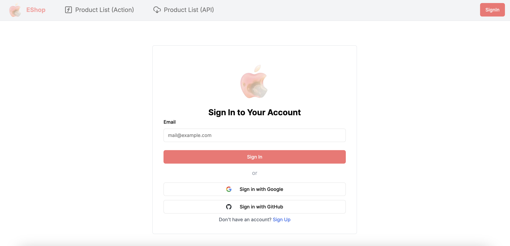
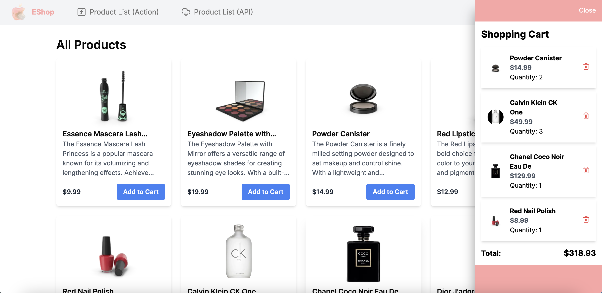

# EShop - A Next.js Side Project

This project is a shopping website, deployed on Vercel, and created to practice and explore Next.js features.

## Features

- OAuth authentication (Sign in with Google and GitHub).
- Login using Magic Link.
- Shopping cart functionality to add or remove products.
- Filter, search, and sort the product list.
- Utilize Prisma ORM to perform CRUD operations on product data.
- Fetch data using Route Handlers (API) and Server Actions.
- Like or unlike products to add them to a favorites list.
- Preview and upload avatar images through the user profile (stored in Pinata).

## Demo

Website Link: [https://my-test-app2-nextjs-prisma.vercel.app/](https://my-test-app2-nextjs-prisma.vercel.app/)

## Tech Stack

- [Next.js](https://nextjs.org/)
- [Tailwind CSS](https://tailwindcss.com/)
- [Prisma](https://www.prisma.io/)
- [Vercel Postgress](https://vercel.com/docs/storage/vercel-postgres)
- [Auth.js](https://authjs.dev/reference/nextjs)
- [Zustand](https://docs.pmnd.rs/zustand/getting-started/introduction)
- [React-Hook-Form](https://react-hook-form.com/)
- [Zod](https://zod.dev/)
- [SweetAlert2](https://sweetalert2.github.io/)
- [Lucide-React](https://lucide.dev/guide/packages/lucide-react)
- [Shadcn/ui](https://ui.shadcn.com/)
- [SWR](https://swr.vercel.app/)
- [ESLint](https://eslint.org/)
- [Prettier](https://prettier.io/)
